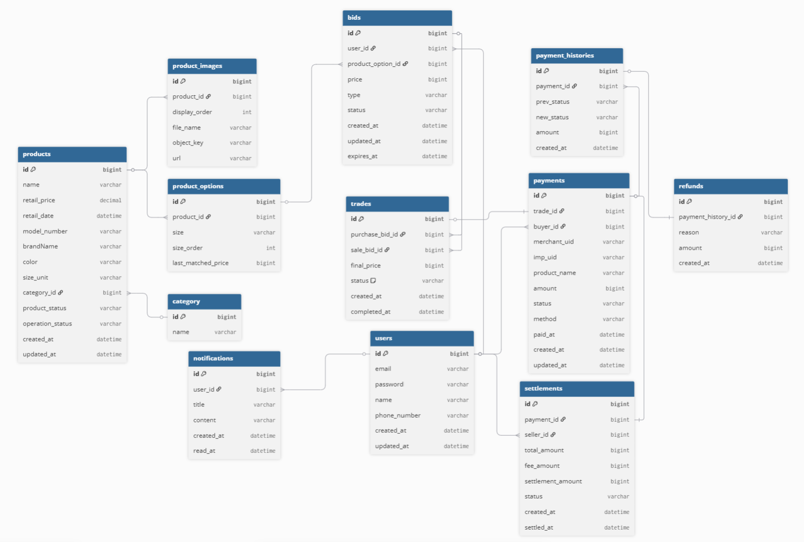
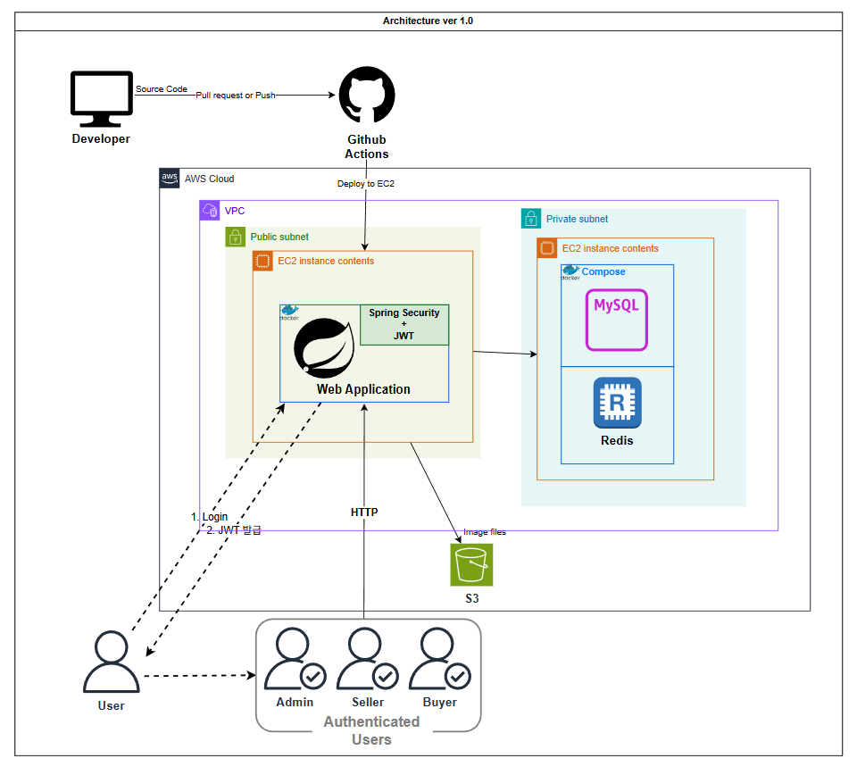
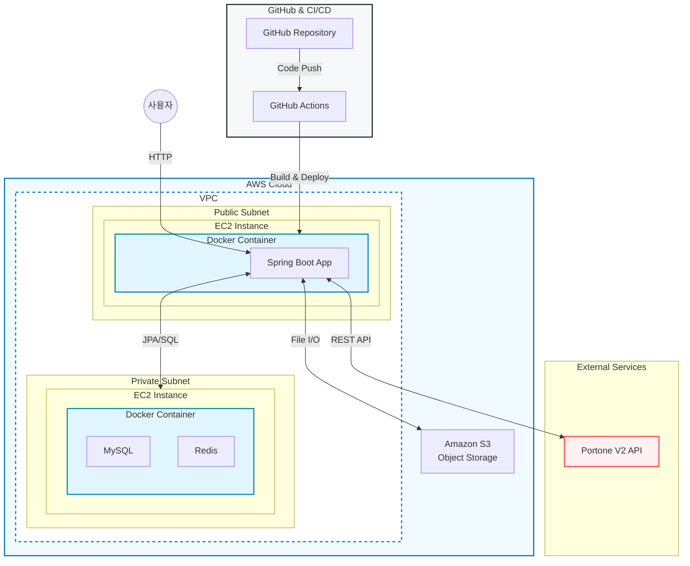
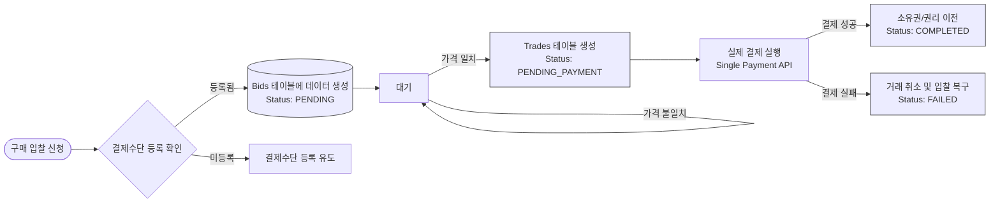
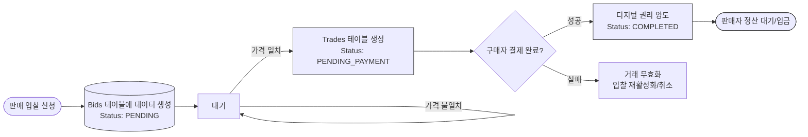
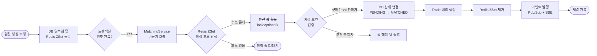
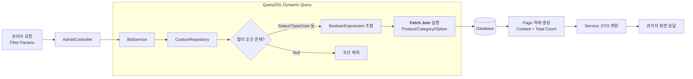
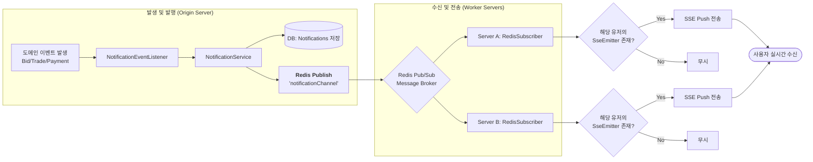
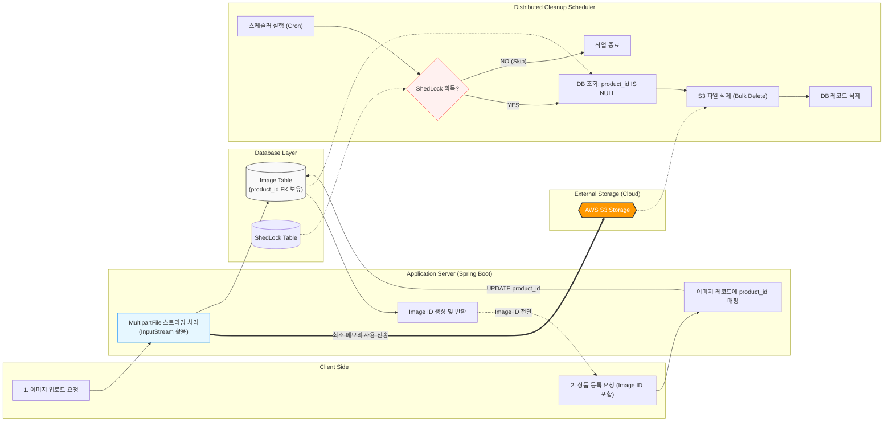

# 👟 CREAM
실시간 시세 거래 플랫폼 특징 중 '입찰 시스템'과 '결제 검증'을 구현한 백엔드 프로젝트입니다.
---

## 1. 프로젝트 소개 (Project Overview)
본 프로젝트는 [KREAM](https://kream.co.kr)을 벤치마킹하여 개발한 **C2C 리셀(Resale) 거래 중개 서비스**입니다.
주식 시장의 호가 주문 방식과 유사한 **입찰 및 체결 시스템**을 핵심 기능으로 구현하였으며, 대용량 트래픽 상황과 데이터 무결성을 고려한 백엔드 시스템 구축에 중점을 두었습니다.
(검수 및 배송과 같은 오프라인 물류, 정책 관련 로직은 제외하고, 온라인 거래 중개 로직을 중심으로 구현했습니다.)

### **핵심 목표**:
 - 데이터 정합성 및 실시간성: 초단위로 변동하는 대량의 입찰 데이터 사이에서 오차 없는 실시간 매칭 및 체결 정합성 확보
  - 분산 환경 최적화: 다중 서버(Scale-out) 환경에서도 메시지 유실 없는 저지연 실시간 알림(Push) 시스템 구축
  - 운영 효율성 극대화: QueryDSL을 활용하여 복잡한 데이터 간 관계를 정의하고, 관리자가 즉각 대응 가능한 강력한 모니터링 및 제어 도구 제공
### **주요 성과**
  - 고성능 매칭 엔진: Redis Sorted Set 기반의 우선순위 큐를 구축하여, 가격 및 시간 우선순위에 따른 매칭 엔진 조회 성능을 $O(\log N)$으로 최적화
  - 분산 동시성 제어: Redisson 분산 락을 도입하여 동일 상품에 대한 중복 체결 등 Race Condition을 해결하고, 분산 서버 환경에서 데이터 무결성 보장
  - 서버 간 이벤트 동기화: SSE와 Redis Pub/Sub을 결합하여 유저가 어떤 서버 인스턴스에 접속하더라도 실시간 알림을 수신할 수 있는 브로드캐스팅 구조 설계
  - 비동기 이벤트 기반 아키텍처: Spring Event를 도입하여 입찰/체결 로직과 알림/로그 로직을 분리, 메인 비즈니스 트랜잭션의 응답 속도 대폭 개선
  - 동적 쿼리 최적화: QueryDSL의 Fetch Join과 동적 필터링을 활용하여 관리자용 대용량 입찰·거래 내역 조회 시 발생하는 N+1 문제를 해결하고 쿼리 성능 향상

---
## 2. 기술 스택 (Tech Stack)
### Backend
| 분류                                                    | 	기술 (Technology)                  | 상세사유                            |
|--|--|---------------------------------|
 | Language  | 	Java 17                          |현대적 기능을 활용한 코드 가독성 및 생산성 향상|
 | Framework	| Spring Boot 3.x                   | Spring Security, JPA 등 견고한 생태계 활용 |
 | Database	| MySQL 8.0, Redis                  | 영속 데이터 저장 및 고성능 랭킹/알림 브로커 활용    |
|Documentation	|Swagger|	Restful API 명세 자동화 및 클라이언트 협업 효율화|
|ORM/Query	|Spring Data JPA, QueryDSL| 	컴파일 타임 타입 체크 및 동적 필터링 쿼리 최적화   |
|Concurrency|	Redisson| 	분산 환경에서의 안전한 체결 처리를 위한 분산 락 구현 |
 | Infrastructure| 	AWS (EC2, VPC, S3), Docker, Nginx |컨테이너 기반 배포 및 확장성 확보|
 | CI/CD	| GitHub Actions                    |지속적 통합 및 자동 배포 파이프라인 구축|
 | Testing & Monitoring	| JUnit 5, k6, Prometheus, Grafana  |실시간 메트릭 수집 및 시스템 상태 시각화|
| Payment  | 	PortOne V2 API                   |결제 사전/사후 검증을 통한 거래 신뢰성 확보|

### Tools
* Build: Gradle
* Documentation: Postman
* Version Control: Git
* Collaboration: Slack, Notion
---

## 3. ERD 및 아키텍처 (ERD & Architecture)
### 엔티티 관계도 (ERD)


프로젝트의 데이터 모델은 거래의 유연성과 이력 관리에 집중하여 설계되었습니다.
* Bid (Purchase/Sale): 사용자의 입찰 정보를 저장하며, Trade로 체결되기 전까지의 상태를 관리합니다.
* Trade: 입찰이 일치하거나 즉시 구매/판매가 이루어질 때 생성되는 핵심 거래 데이터입니다.
* Payment & History: 결제 상태(READY, PAID, CANCELLED)를 관리하며, 결제 시점의 모든 로그를 PaymentHistory에 기록하여 추적 가능성을 높였습니다.
* BaseTimeEntity: 모든 엔티티가 상속받아 생성/수정 시간을 자동 추적하도록 공통화하였습니다.

---
### 시스템 아키텍처


---
## 4. 주요 기능 (Key Features)
### 1. 입찰시스템
### 구매자 플로우 차트


### 판매자 플로우차트

- #### Redis 기반 실시간 매칭 대기열
  - **Sorted Set(ZSet) 활용**: 입찰가와 등록 시간을 조합한 스코어링을 통해 **'가격 우선, 시간 우선'** 원칙을 시스템 레벨에서 보장합니다.
  - **성능 최적화**: DB 조회 없이 Redis 내에서 즉시 최적의 매칭 대상을 탐색합니다.

- #### 분산 환경에서의 데이터 정합성
  - **Redisson 분산 락**: `BidLockFacade`를 통해 입찰/수정/취소 시 발생할 수 있는 경쟁 상태를 차단합니다.
  - **낙관적 락**: DB 수준에서 한 번 더 데이터 충돌을 방지하여 이중 보안을 구축했습니다.

- #### 트랜잭션 동기화
  - **After-Commit 매칭**: `TransactionSynchronizationManager`를 사용하여 DB에 입찰 정보가 완전히 저장(Commit)된 직후에만 매칭 엔진을 가동합니다. 이는 데이터 미반영 상태에서 매칭이 시도되는 '팬텀 리드' 문제를 원천 차단합니다.

- #### 사용자 보호 및 관리 기능
  - **페널티 시스템**: 불량 사용자의 입찰을 Redis 캐싱을 통해 빠르게 필터링합니다.
  - **관리자 강제 취소**: 비정상적인 입찰 상황에 대비해 관리자가 사유를 기록하며 강제 조정할 수 있는 통제권을 확보했습니다.
---
###  2.  자동체결엔진
### 체결엔진 플로우차트

- #### 최적가 매칭
  - **Redis 기반 우선순위 탐색**: Redis Sorted Set(ZSet)을 활용하여 구매자는 가장 낮은 판매가를, 판매자는 가장 높은 구매가를 즉시 탐색합니다
  - 제시한 조건(구매가 $\ge$ 판매가)에 부합하는지 즉시 검증합니다.
- #### 거래(Trade) 생명주기 관리
  - **단계별 상태 추적**: 결제 대기→ 결제 완료 → 취소로 이어지는 거래 흐름을 체계적으로 관리합니다.
  - **복구 메커니즘**: 거래가 취소될 경우, 피해를 입은 상대방의 입찰은 다시 대기 상태로 복구하여 재매칭 기회를 제공합니다.
- #### 거래 취소 및 페널티 정책
  - **사용자 주도 취소**: 체결 당사자(구매자/판매자)가 결제 완료 전 거래를 철회할 수 있는 기능을 제공합니다.
  - **입찰 제한 페널티**: 거래를 일방적으로 취소한 사용자에게는 3일간 입찰 등록을 제한하는 페널티 정보를 Redis와 연동하여 관리합니다.
---

### 3. 관리자  모니터링
### 관리자 모니터링(QueryDsl)플로우차트

- #### QueryDSL을 활용한 복잡한 동적 필터링 구현
  - 관리자 페이지는 상품 ID, 카테고리, 입찰 상태, 유저 식별자 등 수많은 검색 조건이 조합됩니다. 기존 Spring Data JPA의 메서드 명명 방식으로는 한계가 있어 QueryDSL을 도입했습니다.
  - 동적 쿼리 최적화: 모든 검색 조건(상품, 카테고리, 상태 등)을 Optional하게 처리하여, 파라미터가 있는 경우에만 where 절에 포함되도록 설계했습니다. 이를 통해 하나의 메서드로 수십 가지의 검색 조합을 유연하게 처리합니다.
  - 컴파일 타임 타입 체크: 문자열 기반의 JPQL 대신 QClass를 활용함으로써 쿼리 오류를 컴파일 단계에서 잡아내고, 유지보수의 안정성을 높였습니다.

- #### 성능을 고려한 데이터 페치(Fetch) 전략
  - 단순 조회를 넘어 연관된 엔티티(Product, User, Category)를 한꺼번에 가져와야 하는 관리자 기능의 특성상 성능 최적화에 집중했습니다. 
  - Fetch Join 활용: 입찰(Bid) 조회 시 연관된 ProductOption, Product, Category를 Fetch Join으로 한 번에 묶어 가져옴으로써 JPA의 고질적인 문제인 N+1 문제를 원천 차단했습니다.
  - 페이징(Paging) 처리: 수만 건의 데이터를 한꺼번에 로드하지 않고, offset과 limit을 이용한 서버 사이드 페이징을 구현하여 관리자 화면의 응답 속도를 최적화했습니다.
  - Count Query 분리 설계: 페이징 처리 시 데이터 조회 쿼리와 카운트 쿼리를 분리하여, 대량 데이터 환경에서 불필요한 조인(Join)으로 인한 성능 저하를 방지했습니다.

- #### 데이터 정합성과 관리자 개입 기능
   - 단순 조회를 넘어 비정상적인 거래에 대응할 수 있는 관리 기능을 포함했습니다. 
   - 강제 취소 및 이력 관리: 운영 정책에 위반되는 입찰건을 관리자가 직접 취소할 수 있으며, 이때 발생할 수 있는 캐시 불일치를 방지하기 위해 **Redis 캐시 삭제(Cache Evict)**를 동시에 수행합니다.
   - 읽기 전용 트랜잭션: 모니터링 조회 메서드에 @Transactional(readOnly = true)를 적용하여 하이버네이트의 스냅샷 저장 및 더티 체킹 오버헤드를 줄였습니다.

---

### 4. 알림 시스템
### 알림 (Redis Pub/Sub + SSE) 플로우차트

- #### 분산 환경 최적화 실시간 알림 (SSE + Redis Pub/Sub)
  - 실시간 스트리밍(SSE): 클라이언트가 /subscribe 연결 시, 서버와 지속적인 HTTP 연결을 유지하여 이벤트 발생 즉시 푸시를 수신합니다.
  - Redis Pub/Sub 활용: 알림 발생 시 Redis 채널로 메시지를 발행합니다. 이를 통해 수신자가 다른 서버 인스턴스에 접속 중이더라도 모든 서버 노드가 메시지를 수신(Subscribe)하여 대상 유저에게 알림을 전달할 수 있습니다.
- #### 이벤트 기반 비동기 아키텍처
  - **느슨한 결합**: 서비스 간 직접 의존성 대신 `ApplicationEventPublisher`를 사용합니다. 입찰, 체결, 결제 로직은 알림 로직을 몰라도 이벤트만 발행하면 처리가 완료됩니다.
  - **트랜잭션 정합성 보장**: `@TransactionalEventListener(phase = TransactionPhase.AFTER_COMMIT)`를 적용하여, 메인 비즈니스 로직(결제, 체결 등)이 DB에 최종 커밋된 경우에만 알림이 발송되도록 보장합니다.
  - **성능 최적화**: `@Async` 처리를 통해 알림 생성 및 발송 로직이 메인 트랜잭션의 응답 속도에 영향을 주지 않는 비동기 방식으로 동작합니다.
- #### 알림 데이터 관리 및 영속화
  - **상태 추적 및 기록**: 모든 알림은 DB에 저장되며 발송 여부, 발송 시각 등을 관리합니다.
  - **조회 전용 서비스 분리**: `NotificationQueryService`를 통해 사용자별 알림 내역을 최신순으로 페이징 조회하는 기능을 제공하며, 읽기 전용 트랜잭션으로 조회 성능을 높였습니다.
  - **미발송 처리**: 발송 실패 또는 누락된 알림을 수집할 수 있도록 `isSent=false` 상태의 데이터를 필터링하는 기능을 포함합니다.

---
### 5. 이미지 관리 시스템
### 이미지 등록 및 정리 플로우차트



- #### 확장성과 성능을 고려한 업로드 전략 (S3)
    - MultipartFile 스트리밍: 파일을 서버 메모리에 배열로 적재하지 않고 InputStream을 통해 읽는 즉시 AWS S3로 전송합니다. 
                            이를 통해 수천 명의 동시 업로드 시에도 OOM 장애를 예방하고 서버 자원을 효율적으로 관리합니다. 
    - 외부 저장소 활용 (S3): 서버 인스턴스와 무관한 외부 스토리지를 활용하여 인스턴스 확장 시에도 파일 접근성을 보장하는 Stateless 아키텍처를 유지합니다.
- #### 데이터 정합성을 위한 지연 매핑
    - 이미지-상품 분리: 이미지 업로드 시 즉시 Image ID를 먼저 발급하여 클라이언트가 게시글 작성 중에도 이미지를 자유롭게 첨부할 수 있게 합니다.
    - ID 매핑 연계: 최종 상품 등록 시 전달받은 Image ID를 기반으로 DB의 product_id(FK)를 업데이트합니다. 
                  이 과정에서 등록이 완료되지 않은 레코드는 자연스럽게 고아 객체로 분류되어 관리됩니다.
- #### 분산 환경의 안정적 자원 정리 (ShedLock)
    - 스케줄러 중복 제어: 다중 서버 환경에서 각 인스턴스의 스케줄러가 동시에 실행되는 것을 방지하기 위해 ShedLock을 도입했습니다.
    - 효율적 비용 최적화: DB 테이블 내 product_id가 NULL인 대상을 조회하여 실제 유효하지 않은 데이터만 선별합니다. 
                      주기적으로 S3의 고아 객체를 삭제하여 스토리지 과금 비용을 최소화하고 시스템의 청결도를 유지합니다.

## 5. 기술적 의사결정 및 트러블슈팅 (Technical Decision & Troubleshooting)
### 1. 클라우드 기반 배포

- **개발-운영 환경의 일관성**
  각 애플리케이션(백엔드, 데이터베이스)이 동일한 환경에서 동작할 수 있도록 Docker를 사용했습니다.
- **AWS EC2 기반 인프라 구축 및 Nginx 동적 포트 관리**
  EC2의 Public/Private Subnet 구조를 통해 서비스(app)를 통해서만 데이터에 접근할 수 있도록 구분하여 보안을 강화했습니다. 또한 무중단 배포를 위해 Nginx를 활용해 동적으로 운영 서버 포트를 관리해 사용자가 안정적으로 사이트를 이용할 수 있도록 설계했습니다.

### 2. 핵심 비즈니스 로직에 집중

- **보증금, 상품 검증 및 배송 로직을 구현 목표에서 제외**
  기존 Kream에는 판매자를 위한 보증금 제도와 상품 검증, 배송 과정이 있습니다.  
  이 정책적 로직을 MVP 구현 단계에서 구현할 경우 로직 설계의 난이도가 상승해 기술적·성능적·학습적 향상 작업에 집중하지 못할 것이 우려되어 팀 협의를 통해 보증금 제도를 제외하기로 결정했습니다.

### 3. 프론트엔드 연계 - AI 도구 활용

- 페이지 디자인 및 백엔드 연계 작업
  백엔드 개발 작업에 집중하기 위해 UI/UX 디자인은 [Stitch](https://stitch.withgoogle.com/), 프론트엔드 페이지 구성은 [Antigravity](https://antigravity.google/)를 활용했습니다. 프론트엔드와 연계하는 과정에서 백엔드에서 전달되어야 하는 데이터 응답 구조를 재차 점검하고 보완했습니다.
### 4.트러블 슈팅 
- [Wiki](https://github.com/sparta-spring-1/cream/wiki/4.-%ED%8A%B8%EB%9F%AC%EB%B8%94%EC%8A%88%ED%8C%85)에  작성을 하였습니다.
---

## 6. API 명세 (API Documentation)

| Domain      | Method | Endpoint                          | Description        |
|-------------|--------|-----------------------------------|--------------------|
| Auth        | POST   | /v1/auth/signup                   | 회원가입 및 권한 부여       |
| Auth        | POST   | /v1/auth/login                    | 로그인                |
| Auth        | POST   | /v1/auth/reissue                  | 토큰 재발급|
| Mypage      | GET    | /v1/me                            |마이페이지|
| Payment     | POST   | /v1/payments/prepare              |결제 준비|
| Payment     | POST   | /v1/payments/{paymentId}/complete |결제 완료요청|
| Payment     | POST   | /v1/payments/{paymentId}/refund   |환불요청|
| Payment     | GET    | /v1/payments                      |결제데이터 조회|
| Payment     | GET    | /v1/payments/{paymentId}          |특정 결제의 상세 정보를 조회|
| Admin       | POST   | /v1/admin/images/upload           |이미지 업로드|
| Admin       | PATCH  | /v1/admin/bids/{bidId}               | 관리자 권한으로 특정  입찰을 강제 취소 |
| Product     | POST   | /v1/admin/products                | 상품등록|
| Product     | PUT    | /v1/admin/products/{produvtId}    |상품 업데이트|
| Product     | DELETE | /v1/admin/products/{produvtId}    | 상품삭제|
| Settlements | POST   | /v1/settlements                   |사용자 본인의 전체 정산 내역을 조회|
| Settlements | POST   | /v1/settlements/{settlementId}    |특정 정산의 상세 정보를 조회|
| Product     | GET    | /v1/products/{id}                 | 상품 상세 및 시세 조회      |
| Bid         | POST   | /v1/bids                          | 구매/판매 입찰 등록        |
|Bid| GET    | /v1/bids/me                       |현재 내가 입찰 중인 내역 확인|
|Bid| GET    | /v1/bids                          |	특정 상품의 입찰 리스트 조회|
|Bid| PATCH  | /v1/bids/{id}                     |	체결 전 입찰가 또는 상품 옵션 변경|
|Bid| DELETE | /v1/bids/{id}	                    |입찰 취소|
| Trade | DELETE | /v1/trades/{tradeId}              | 체결취소 및 체결 취소 패널티 로직 가동      |
|Notification|GET|/v1/notification|알림 목록 조회|
|Notification|GET|/v1/notification/subscribe|사용자의 실시간 알림 구독을 위한 SSE 연결을 생성|

---

## 7. 회고 및 아쉬운 점 (Retrospective)
### 허아림
- 이번 프로젝트에서 부하테스트를 통해 수십 개의 동시 요청이 들어오자 서버 장애가 발생하는 것을 경험했습니다. 단일 API 요청 때는 발견하지 못했던 결함이었습니다. 실 서비스라고 상상하니 정말 아찔했습니다. 병목 구간을 찾고 해결하는 과정에서 수많은 시행착오를 겪었지만, 그만큼 개발자로서 한 단계 더 성장할 수 있었던 값진 시간이었습니다.

### 김세현
- Redis와 분산 락을 통해 무결성 있는 매칭·알림 시스템을 구축하며 기술적 시야를 넓혔으나, 알림 읽음 처리 등 세밀한 비즈니스 확장성 설계와 협업 과정에서 팀원들의 개발 흐름을 더 깊이 이해하고 소통하지 못한 점에 아쉬움이 남습니다. 하지만 이를 통해 기술적 완성도뿐만 아니라 팀 단위 개발에서 '공유와 소통'의 중요성을 절감했으며, 다양한 기능을 프로젝트에 녹여내며 대용량 트래픽과 협업을 모두 고려하는 개발자로 성장하는 발판이 되었습니다.

### 변채주
- 인프라 설계부터 프론트–백엔드 연동, 무중단 배포 자동화(CI/CD)까지 구현하면서 웹 서비스의 전체적인 흐름을 경험했습니다. 비즈니스 로직의 단순 설계를 넘어서, 서버와 네트워크의 구조와 동작에 관해 깊게 이해하고 시야를 넓힐 수 있었습니다. 다만 아쉬웠던 점은 시간적 제약으로 인해 인프라에 집중하게 되면서 데이터 관점에서 철저하고 확장성있는 비즈니스 로직 설계를 구현하지 못한 점과 코드 리뷰의 지연 문제를 인지했지만 작업에 바빠 팀과 소통하지 못했던 점입니다. 앞으로는 협업 과정에서 수동적인 태도를 버리고 명확한 리뷰 규칙을 제안해 보다 더 적극적으로 소통하려 합니다.
---
## 8.링크 및 배포 정보 (Links & Deployment)
배포 주소: https://www.teamcream.shop

팀 노션: https://www.notion.so/teamsparta/Spring-1-2-2da2dc3ef514805fb4c7ea822fb98722

API 명세서: https://api.teamcream.shop/swagger-ui/index.html (Swagger)

---

## 9. 설치 및 실행 방법 (How to run)
### 1. 환경 요구 사항 (Prerequisites)
- Java 17
- MySQL 8.0
- Redis
- Docker (선택 사항)

### 2. 프로젝트 복제 및 빌드 (Clone & Build)
``` bash
# 레포지토리 클론
git clone https://github.com/sparta-spring-1/cream.git
cd cream

# 빌드 실행 (테스트 제외 시 -x test 추가)
./gradlew clean build -x test
```
### 3. 환경 변수 설정 (Environment Variables)
- 애플리케이션 실행을 위해 환경 변수 설정이 필요합니다. 

| 분류                                                             | 변수명                                                 | 설명                   |
|----------------------------------------------------------------|-----------------------------------------------------|----------------------|
| Database                                                       | LOCAL_DB_USERNAME / LOCAL_DB_PASSWORD,MySQL 접속 계정 정보 
| Redis                                                          | REDIS_HOST / REDIS_PASSWORD                         | Redis 서버 주소 및 비밀번호   |
| AWS| AWS_ACCESS_KEY / AWS_SECRET_KEY| S3 이미지 업로드용 자격 증명    |
| AWS| BUCKET_NAME / AWS_REGION                            | S3 버킷 정보             |
| Payment| PORTONE_STORE_ID / PORTONE_API_SECRET               | 포트원(PortOne) 결제 연동 키 |
|Security| JWT_SECRET / JWT_ISSUER                             | JWT 토큰 생성 및 검증용 비밀키  |

### 4.어플리케이션 실행 (Run)
``` bash
# 빌드된 JAR 파일 실행
java -jar build/libs/cream-0.0.1-SNAPSHOT.jar
```


